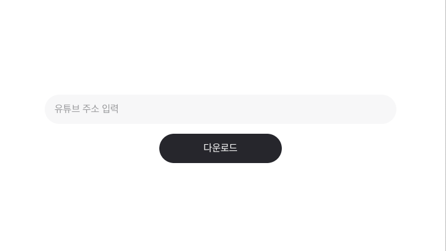

This is a [Next.js](https://nextjs.org) project bootstrapped with [
`create-next-app`](https://nextjs.org/docs/app/api-reference/cli/create-next-app).

**my-music** is a Next.js-based project that allows users to download YouTube videos as MP3 files
using [yt-dlp](https://github.com/yt-dlp/yt-dlp).



## For Dev

```bash
npm install

npm run dev
```

## For Production

```
npm install

npm run build

npm start
# or 
pm2 start npm --name my-music -- run start
```

## 📄 License

This project is licensed under the [MIT License](LICENSE).

## Contributing

Contributions are welcome — feel free to open a pull request anytime!
